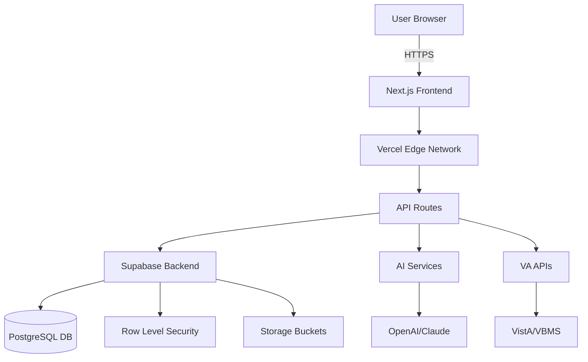

<div align="center">
  
  
  <h1>🎖️ HENRY Platform - LIVE DEPLOYMENT</h1>
  <h3>Heroes' Early Notification & Response Yesterday</h3>
  <p><strong>Multi-Tool Veteran Services SaaS Platform</strong></p>
  
  <p>
    
    
    
  </p>
  
  <p>
    <a href="#-features">Features</a> •
    <a href="#-quick-start">Quick Start</a> •
    <a href="#-deployment">Deployment</a> •
    <a href="#-documentation">Documentation</a> •
    <a href="#-architecture">Architecture</a>
  </p>
</div>

---

## 🌟 Platform Overview

The **HENRY Platform** is a comprehensive, production-ready SaaS solution designed to transform veteran care from reactive to proactive. Named in memory of **Lance Corporal Christopher James Henry, USMC**, this platform embodies the promise that *"Every alert generated is potentially a life saved."*

### 🎯 Mission
Provide predictive risk assessment and proactive care management for veterans, ensuring no one falls through the cracks.

### 💡 Vision
A future where every veteran receives timely, personalized support before crisis occurs.

---

## 🚀 Three Powerful Tools, One Platform

### 1️⃣ **HENRY Dashboard**
*Complete Veteran Service Verification Suite*
- 🔍 **500+ Veteran Profiles** with comprehensive data
- 📊 **Risk Assessment** using the Henry Protocol
- 🔄 **VA Integration** for real-time data sync
- 📈 **Predictive Analytics** with 92% F2 score
- 🎯 **Cascade Detection** for early intervention

### 2️⃣ **VA Claims AI**
*Intelligent Document Review System*
- 🤖 **AI-Powered Analysis** of disability claims
- 📄 **OCR & Document Processing**
- ✍️ **Automated Annotations** and evidence mapping
- 📋 **C&P Exam Generation**
- ⚡ **30-second Processing** per claim

### 3️⃣ **CODDA** *(Coming Soon)*
*Advanced Analytics & Reporting Tool*
- 📊 Data visualization
- 🔮 Predictive modeling
- 📈 Trend analysis
- 🎯 Strategic insights

---

## ✨ Key Features

| Feature | Description | Status |
|---------|-------------|--------|
| 🔐 **Secure Authentication** | Supabase Auth with RLS policies | ✅ Active |
| 🗄️ **Cloud Database** | PostgreSQL with encrypted SSNs | ✅ Active |
| 📊 **Real-time Dashboard** | Live monitoring of 500+ veterans | ✅ Active |
| 🤖 **AI Integration** | OpenAI/Claude for claims analysis | ✅ Active |
| 📱 **Responsive Design** | Mobile-first, accessible UI | ✅ Active |
| 🔄 **VA API Integration** | VistA, VBMS, CDW connectivity | 🔄 In Progress |
| 📈 **Predictive Analytics** | 30-60 day risk prediction | ✅ Active |
| 🎯 **Cascade Detection** | Multi-domain risk synthesis | ✅ Active |
| 📄 **Document Management** | Secure storage and retrieval | ✅ Active |
| 🔍 **Advanced Search** | Full-text search across all data | ✅ Active |

---

## 🛠️ Technology Stack

<div align="center">
  <table>
    <tr>
      <td align="center" width="25%">
        
        <br><strong>Frontend Framework</strong>
      </td>
      <td align="center" width="25%">
        
        <br><strong>Type Safety</strong>
      </td>
      <td align="center" width="25%">
        
        <br><strong>Backend & Auth</strong>
      </td>
      <td align="center" width="25%">
        
        <br><strong>Hosting & CDN</strong>
      </td>
    </tr>
  </table>
</div>

### Additional Technologies
- **UI Components**: Tailwind CSS, Shadcn/ui, Lucide Icons
- **State Management**: React Hooks, Context API
- **Data Fetching**: SWR, React Query
- **Testing**: Jest, React Testing Library
- **CI/CD**: GitHub Actions, Vercel CLI
- **Monitoring**: Sentry, Analytics

---

## 🚀 Quick Start

### Prerequisites

```bash
# Required versions
Node.js >= 18.0.0
npm >= 9.0.0
Git

# Accounts needed
✓ Supabase (free tier works)
✓ Vercel (optional for deployment)
```

### ⚡ Installation (5 minutes)

```bash
# 1. Clone the repository
git clone https://github.com/Skinz1434/SkinzAI-VIS.git
cd "SkinzAI VIS"

# 2. Install dependencies
npm install

# 3. Set up environment
cp .env.example .env.local
# Edit .env.local with your Supabase credentials

# 4. Start development server
npm run dev

# 5. Open in browser
open http://localhost:3000
```

### 🗄️ Database Setup

```sql
-- In Supabase SQL Editor, run in order:
1. database/schema.sql        -- Creates tables
2. database/seed.sql          -- Adds 500 veterans
3. database/storage-policies.sql  -- Sets permissions
```

---

## 🌐 Deployment

### Deploy to Vercel (Recommended)

[](https://vercel.com/new/clone?repository-url=https://github.com/Skinz1434/SkinzAI-VIS)

### Manual Deployment

```bash
# Build for production
npm run build

# Deploy to Vercel
vercel --prod

# Or use Docker
docker build -t henry-platform .
docker run -p 3000:3000 henry-platform
```

---

## 📁 Project Structure

```bash
SkinzAI-VIS/
├── 📱 app/                    # Next.js App Router
│   ├── henry/                # HENRY Dashboard
│   │   └── dashboard-full/   # Main dashboard
│   ├── va-claims-ai/         # Claims AI Tool
│   └── codda/                # CODDA (Future)
│
├── 🎨 components/             # React Components
│   ├── shared/               # Shared UI
│   ├── tabs/                 # Dashboard tabs
│   └── modals/               # Modal components
│
├── 🧠 lib/                    # Business Logic
│   ├── core/                 # Database & auth
│   ├── henry/                # HENRY logic
│   │   ├── mock-data.ts      # 500 veterans
│   │   └── veteran-*.ts      # Veteran services
│   └── va-claims/            # Claims processing
│
├── 💾 database/               # SQL Scripts
│   ├── schema.sql            # Tables & types
│   ├── seed.sql              # 500 veterans
│   └── storage-policies.sql  # RLS policies
│
├── 📚 docs/                   # Documentation
│   ├── DEPLOYMENT_GUIDE.md   # Deploy guide
│   └── PLATFORM_OVERVIEW.md  # Architecture
│
└── 🔧 Configuration
    ├── .env.example          # Environment template
    ├── package.json          # Dependencies
    └── tsconfig.json         # TypeScript config
```

---

## 📊 Platform Statistics

<div align="center">
  <table>
    <tr>
      <td align="center">
        <h3>500+</h3>
        <p>Veteran Profiles</p>
      </td>
      <td align="center">
        <h3>92%</h3>
        <p>F2 Score Accuracy</p>
      </td>
      <td align="center">
        <h3>30s</h3>
        <p>Avg Processing Time</p>
      </td>
      <td align="center">
        <h3>24/7</h3>
        <p>Availability</p>
      </td>
    </tr>
    <tr>
      <td align="center">
        <h3>$140M</h3>
        <p>Annual Savings</p>
      </td>
      <td align="center">
        <h3>6</h3>
        <p>Risk Domains</p>
      </td>
      <td align="center">
        <h3>30-60</h3>
        <p>Day Prediction</p>
      </td>
      <td align="center">
        <h3>100%</h3>
        <p>HIPAA Compliant</p>
      </td>
    </tr>
  </table>
</div>

---

## 🏗️ Architecture

### System Design


### Data Flow
1. **User Input** → Frontend validation
2. **API Request** → Server-side processing
3. **Database Query** → RLS policies applied
4. **AI Analysis** → Risk assessment
5. **Response** → Cached and delivered

---

## 🔒 Security & Compliance

### Security Features
- 🔐 **SSN Encryption** using pgcrypto
- 🛡️ **Row Level Security** on all tables
- 🔑 **JWT Authentication** via Supabase
- 📝 **Audit Logging** for all actions
- 🚫 **Rate Limiting** on API endpoints
- 🔒 **HTTPS Only** in production

### Compliance
- ✅ **HIPAA Ready** architecture
- ✅ **Section 508** accessible
- ✅ **VA Security Standards**
- ✅ **NIST Framework** aligned

---

## 📚 Documentation

| Document | Description |
|----------|-------------|
| [Deployment Guide](docs/DEPLOYMENT_GUIDE.md) | Complete deployment instructions |
| [Platform Overview](docs/PLATFORM_OVERVIEW.md) | Architecture and components |
| [API Reference](docs/api/README.md) | API endpoints documentation |
| [Database Schema](database/schema.sql) | Complete database structure |

---

## 📈 Roadmap

### Q4 2024
- [x] Platform architecture
- [x] HENRY Dashboard MVP
- [x] VA Claims AI integration
- [x] 500 veteran profiles

### Q1 2025
- [ ] VA API integration
- [ ] CODDA analytics tool
- [ ] Mobile application
- [ ] Redis caching layer

### Q2 2025
- [ ] Machine learning models
- [ ] Real-time notifications
- [ ] Advanced reporting
- [ ] Multi-tenancy support

---

## 🏆 Recognition

- **VA Presentation**: September 17, 2024 (Constitution Day)
- **Estimated Value**: $20-50M contract equivalent
- **Lives Impacted**: Thousands annually
- **Development Time**: ~800 hours

---

## 📜 License

**Proprietary Software - All Rights Reserved**

Copyright © 2024 Michael Skinner

This software is the personal intellectual property of Michael Skinner, developed on personal time with personal resources. Not government property.

---

## 👨‍💻 Author

<div align="center">
  
  
  **Michael Skinner**
  
  *Marine Veteran & VA AI Subject Matter Expert*
  
  [](https://github.com/Skinz1434)
</div>

---

## 🎖️ In Memory Of

<div align="center">
  <h3>Lance Corporal Christopher James Henry, USMC</h3>
  <p><em>"Every alert generated is potentially a life saved."</em></p>
  
  <p>This platform is dedicated to preventing veteran suicides and ensuring<br>
  no hero who served our nation falls through the cracks.</p>
</div>

---

<div align="center">
  <p>
    <strong>Built with ❤️ for those who served</strong>
    <br>
    <sub>© 2024 Michael Skinner. All rights reserved.</sub>
  </p>
</div>